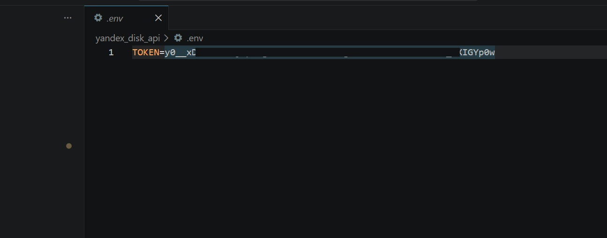
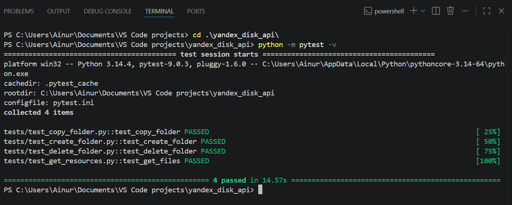

# Автотесты Yandex Disk API 

Проект содержит автоматизированные тесты для проверки работы API Yandex Disk.

---

Покрытые методы: 
- GET 
- PUT 
- POST 
- DELETE

---

Стек технологий:
* Python
* pytest
* requests
* dotenv

---

## Установка зависимостей

Необходимо установить зависимости: pytest, requests, python-dotenv

```bash
pip install -r requirements.txt
```

## Настройка токена

Для работы с API необходимо указать OAuth-токен Яндекс Диска в .env файле перед запуском тестов:
1. В корне проекта (в папке yandex_disk_api) создайте файл .env
2. Добавьте в него:
```python
TOKEN=твой_токен #вместо твой_токен необходимо ввести OAuth-токен Яндекс Диска
```



## Запуск тестов

Перейдите в корневую папку проекта:

```bash
cd yandex_disk_api
```

Запустите тесты:

```bash
python -m pytest -v
```

## Результат тестов

